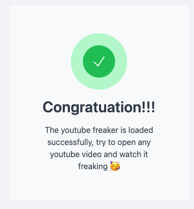

  

#### How it works ?
- The script runs only in tabs where `https://www.youtube.com/watch?v=*` is matching, which are videos.
- If the playing video is an `AD` the tab will reload, until there is no ad, which take from 2 to 4 reloads, no worries, it's quick and it works 😉.

## Installation

### Prerequisites

- A Chrome-based browser (Google Chrome, Brave, Arc, etc.)
- Download from releases and load `plugin` folder after `unzipping it` or clone the project and follow.

### Steps

1. Clone this repository to your local machine.
2. Open `chrome://extensions/` in your browser.
3. Enable `developer mode`.
4. Click on `Load unpacked` and select the cloned project directory.